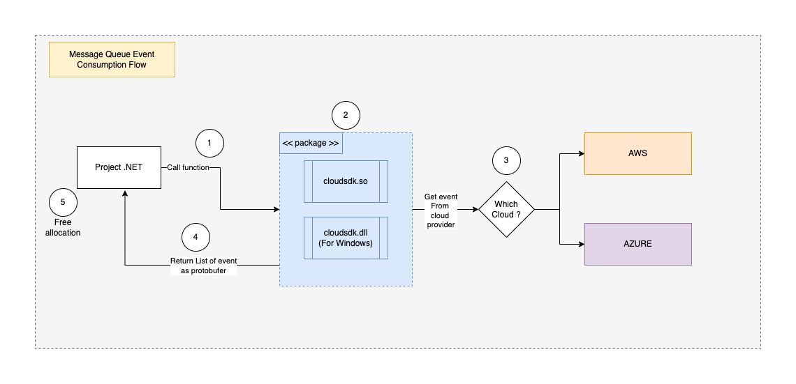

# Interoperabilidade 

Testar se o conceito de interoperabilidade atende aos seguintes requisitos:

**Codebase único e reutilizável:** Manter um único código-fonte que possa ser reutilizado em diversas linguagens de programação.

**Agnóstico:** O código deve ser capaz de integrar-se tanto com AWS quanto com Azure, sem dependência específica de um provedor de nuvem.

**Baixa latência:** Garantir que as operações realizadas por meio da interoperabilidade apresentem tempo de resposta mínimo.

**Facilidade de reutilização**: Tornar o código simples de reutilizar em diferentes contextos e aplicações.

**Alta performance:** As interações entre diferentes linguagens e a nuvem devem ser eficientes em termos de recursos e processamento.

**Facilidade de uso:** A integração deve ser intuitiva e simples, permitindo que desenvolvedores de diferentes áreas possam utilizar sem complexidade.

# Proposta de solução: 

### FFI (Foreign Function Interface)

O Foreign Function Interface (FFI) é um mecanismo que permite que programas escritos em uma linguagem chamem funções ou utilizem bibliotecas escritas em outra linguagem. Isso pode ser útil quando se deseja integrar código nativo (como C, C++, Rust ou Go) com linguagens de mais alto nível, como Python, Java e C#.

Com FFI podemos reaproveitar bibliotecas existentes e facilitar a interoperabilidade entre diferentes tecnologias. No entanto, ele pode introduzir desafios como gerenciamento de memória, compatibilidade de tipos e diferenças entre convenções de chamada das linguagens envolvidas.

Para saber mais sobre FFI, [clique aqui]()

**Para esta prova de conceito, utilizaremos as seguintes tecnologias:**

**GO:** A linguagem Go será utilizada para desenvolver o módulo que implementará as funcionalidades da nuvem (AWS e Azure) e exporá os contratos que serão utilizados por outras linguagens.

**Protobuf:** O protocolo Protobuf será adotado para serialização dos dados entre os componentes, garantindo uma comunicação eficiente e compacta.

**Java/C#/Python:** Será criado um exemplo para importar e utilizar o pacote desenvolvido em Go, demonstrando como as diferentes linguagens podem interagir com o módulo Go via FFI (Foreign Function Interface).

### Exemplo de uso

**Cenário 1:** Implementar uma função que consumirá eventos de filas de mensageria da Azure ou AWS. O provedor será escolhido em tempo de execução com base no valor da variável de ambiente "cloudsdk_provider". A coleção de eventos deverá ser serializada utilizando Protobuf e retornada ao chamador de forma eficiente.

### Resultado da Prova de conceito:

**Contras:**

   - **Integração entre linguagens:** A integração de entre diferentes linguagens pode ser complexa e exigir um esforço significativo (ainda mais de como será utilizado), como o uso de JNI(sofrivel em Java, porém, mais flexivel quando se utiliza JNA), que pode ser difícil de configurar corretamente em comparação com C# ou Python, onde a integração foi mais simples.
    
   - **Gerenciamento de memoria:** O gerenciamento de memoria pode ser um desafio, por exemplo, no C# e no python eu notei que funcionou bem, mas no Java eu percebi que em algum momento o objeto retornado pelo pacote foi descartado (não analisei com profundidade) e esse tipo de comportamento me chamou a atenção, a solução paliativa foi implementar uma função do lado do GO para ser chamada quando houver necessidade de desalocar a memoria (aqui ja temos uma mistrura de conceitos estaticos, onde eu entrego um controle sob um objetco de uma linguagem staticamente gerenciada)
  
   - **Tipagem:** Por mais que declaremos um tipo Protobuf no projeto em GO; java e C# sempre irão esperar um []bytes o que faz perder a visibilidade do retorno e o poder da tipagem.

   - **Alocação de memória no C:** Se a função nativa precisar alocar memória para os dados (como buffers ou estruturas), e a linguagem hospedeira (como Java ou C#) precisar limpar essa memória depois de usá-la, isso pode gerar overhead adicional, pois o gerenciamento de memória entre as linguagens pode ser complexo e propenso a erros.

   - **Uso de C:** Precisamente precisaremos utilizar a linguagem C em GO para alguma coisa

**Prós**:
   - **Reuso de Código Centralizado**
   - **Integração entre Linguagens Diferentes**
   - **Agnosticismo de Plataforma**

  

