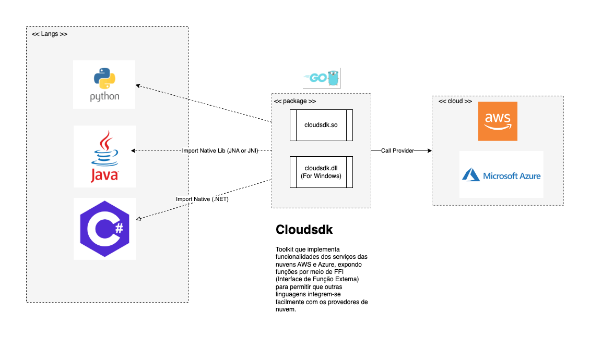

# FFI (Foreign Function Interface)

O Foreign Function Interface (FFI) é um mecanismo que permite que programas escritos em uma linguagem chamem funções ou utilizem bibliotecas escritas em outra linguagem. Isso pode ser útil quando se deseja integrar código nativo (como C, C++, Rust ou Go) com linguagens de mais alto nível, como Python, Java e C#.

Com FFI podemos reaproveitar bibliotecas existentes e facilitar a interoperabilidade entre diferentes tecnologias. No entanto, ele pode introduzir desafios como gerenciamento de memória, compatibilidade de tipos e diferenças entre convenções de chamada das linguagens envolvidas.

Para saber mais sobre FFI, [clique aqui]()

# Requisitos 

Testar se o conceito de interoperabilidade atende aos seguintes requisitos:

##Codebase único e reutilizável:## Manter um único código-fonte que possa ser reutilizado em diversas linguagens de programação.

##Agnóstico:## O código deve ser capaz de integrar-se tanto com AWS quanto com Azure, sem dependência específica de um provedor de nuvem.

##Baixa latência:## Garantir que as operações realizadas por meio da interoperabilidade apresentem tempo de resposta mínimo.

##Facilidade de reutilização##: Tornar o código simples de reutilizar em diferentes contextos e aplicações.

##Alta performance:## As interações entre diferentes linguagens e a nuvem devem ser eficientes em termos de recursos e processamento.

##Facilidade de uso:## A integração deve ser intuitiva e simples, permitindo que desenvolvedores de diferentes áreas possam utilizar sem complexidade.

# Proposta de solução

  

